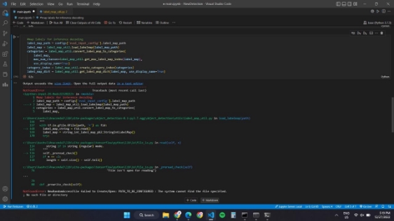

# Tensorflow-Object-Detection
This project is a machine learning model that detects food items in videos using TensorFlow and SSD MobileNet. The model is trained on the Common Objects in Context (COCO) dataset, which contains over 330,000 images of 80 object categories, including food items.The video is first converted into individual frames, and the model then calculates the accuracy of detection for each frame in the video. The results are displayed in a user-friendly format.
This project was done under the guidance of Prof. Mitali Mukherjee (BSBE dept, IIT Jodhpur). It was a subsection of AR/VR app constructor for digital food experience. 
Contributors: [@kashvi0](https://github.com/kashvi0); @Anurag-Kumar-Bharti

**Digital Food Experiencing using AR/VR**

**Team members:**

Arun Raghav S Anurag Kumar Bharti Kashvi Jain

**Object detection using Tensorflow**

**Tensorflow:** It is a free and open-source software library for machine learning and artificial intelligence. It can be used across a range of tasks but focuses on training and inference of deep neural networks.

**Learning Curve:**

We followed the course on object detection on [youtube](https://www.youtube.com/watch?v=yqkISICHH-U&t=2260s) and trained our own model to detect different hand gestures in images and real-time using a webcam.

Followed the steps provided by [Github Repository](https://github.com/nicknochnack/TFODCourse).

The model was trained to detect four classes of hand gestures: Thumbs Up, Thumbs down, ThankYou, and Livelong.

The model could then detect hand gestures in real time. Here are some screenshots of the same:

Here is the video link for the real-time detection: [link](https://drive.google.com/file/d/1qrBVgpO8663VbQpn2BKV_TSPXYzMnkoO/view?usp=sharing)

But this model didn’t work well when we trained it for different food models as it identified objects incorrectly. So, we used a pre-trained model on the coco dataset.

**COCO-DATASET**

COCO stands for Common Objects in Context, as the image dataset was created to advance image recognition. The COCO dataset contains challenging, high-quality visual datasets for computer vision, primarily state-of-the-art neural networks. For example, COCO is often used to benchmark algorithms to compare the performance of real-time object detection. The format of the COCO dataset is automatically interpreted by advanced neural network libraries. The COCO dataset classes for object detection and tracking include the following pre-trained 80 objects:

We then worked on three different models.

1) **First model**

LINK:-[custom-object-detection-using-tensorflow-from-scratch](https://towardsdatascience.com/custom-object-detection-using-tensorflow-from-scratch-e61da2e10087)

In this model, ssd\_mobilenet\_v2\_coco, the object was detected with low accuracy and fluctuated labeling (i.e other objects were also detected with the specified object).We also tried to rectify the problem by increasing the number of steps and training the model with more images, but there were no changes in the output.

2) **Second model**

LINK:-[https://heartbeat.comet.ml/real-time-object-detection-using-ssd- mobilenet-v2-on-video-streams-3bfc1577399c](https://heartbeat.comet.ml/real-time-object-detection-using-ssd-mobilenet-v2-on-video-streams-3bfc1577399c)

We were not able to use this model because we were getting a particular error which couldn’t be resolved despite all our efforts. A screenshot of the error faced is attached below:

3) **Third model**

LINK:-[Object Detection using SSD Mobilenet and Tensorflow Object Detection API : Can detect any single class from coco dataset. | by mayank singhal | Medium](https://medium.com/@techmayank2000/object-detection-using-ssd-mobilenetv2-using-tensorflow-api-can-detect-any-single-class-from-31a31bbd0691)

Out of all three models, the third one worked fine and detected objects with high accuracy. So, we decided to proceed with that. We’ve attached screenshots of the image detection of different food items present in the coco dataset by the model. We detected the objects like cake, apple, carrots, bananas, and broccoli as shown below.

**Object detection in video**

We then wrote the code for saving frames from the video in jpg format. Then, using the code for XML generation for images, we generated the XML files for video frames.

Below are the attached screenshots showing the frames of the videos saved in jpg format and the XML files generated for the frames:

And here is a screenshot of the code:

xml generated:

**ThankYou**
